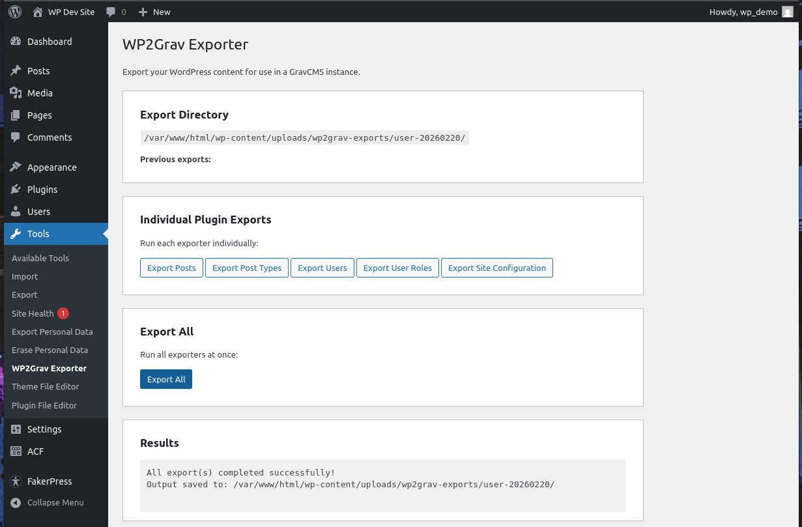

# Grav Export

Exports WordPress content to GravCMS-compatible format via WP-CLI or the WordPress admin UI.

## Documentation

- [Installation & Setup](docs/installation.md)
- [Export All](docs/export-all.md) — `wp wp2grav-all`
- [Export Posts](docs/export-posts.md) — `wp wp2grav-posts`
- [Export Users](docs/export-users.md) — `wp wp2grav-users`
- [Export Roles](docs/export-roles.md) — `wp wp2grav-roles`
- [Export Post Types](docs/export-post-types.md) — `wp wp2grav-post-types`
- [Export Site Metadata](docs/export-site.md) — `wp wp2grav-site`

## Quick Start

1. Install the plugin and activate it (see [Installation](docs/installation.md)).
2. Run `wp wp2grav-all` or use **Tools > WP2Grav Exporter** in the WordPress admin.
3. Copy the exported files from `wp-content/uploads/wp2grav-exports/<export-dir>/` to your Grav `user/` directory.

