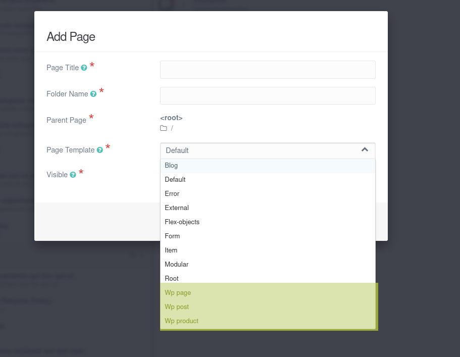

# Export Post Types (`wp2grav-post-types`)

Generates a Grav companion plugin (`wordpress-exporter-helper`) with page type blueprints and Twig templates corresponding to each WordPress post type.



## Usage

**WP-CLI:**
```bash
wp wp2grav-post-types
```

**Admin UI:** 

Click the **Export Post Types** button under Tools > WP2Grav Exporter.

## What It Exports

- A complete Grav plugin skeleton (`plugins/wordpress-exporter-helper`), along with supporting composer dependencies.
- One blueprint YAML file per public WordPress post type, prefixed with `wp_`
- One Twig template per post type
- Blueprint fields derived from the post type's registered features (title, excerpt, thumbnail, author, etc.)
- ACF (Advanced Custom Fields) field definitions, if the ACF plugin is active

## Output Structure

```
<export-dir>/plugins/wordpress-exporter-helper/
├── blueprints/
│   ├── wp_post.yaml        # Blueprint for 'post' type
│   ├── wp_page.yaml        # Blueprint for 'page' type
│   └── wp_<type>.yaml      # One per public post type
├── templates/
│   ├── wp_post.html.twig
│   ├── wp_page.html.twig
│   └── wp_<type>.html.twig
├── blueprints.yaml
├── wordpress-exporter-helper.php
├── wordpress-exporter-helper.yaml
├── composer.json
├── vendor/
|   └── [composer dependencies]
└── [other plugin files]
```

## Blueprint Fields

The generated blueprints include admin form fields for each feature registered on the post type:

| WordPress feature                      | Grav field type                        |
| -------------------------------------- | -------------------------------------- |
| `title`                                | `text`                                 |
| `excerpt`                              | `text`                                 |
| `thumbnail`                            | `file` (jpg, jpeg, png, gif)           |
| `author`                               | `array`                                |
| ACF `text`/`email`/`number`/`textarea` | Matching type                          |
| ACF `image`                            | `filepicker`                           |
| ACF `range`                            | `range` (with min/max/step validation) |

## ACF Support

If the [Advanced Custom Fields](https://www.advancedcustomfields.com/) plugin is active, the exporter inspects all posts of each type to discover ACF fields and adds an **ACF Fields** tab to the blueprint.

## Importing to Grav

Copy the `<export-dir>/plugins/` directory to your Grav's `user/plugins/` directory.
