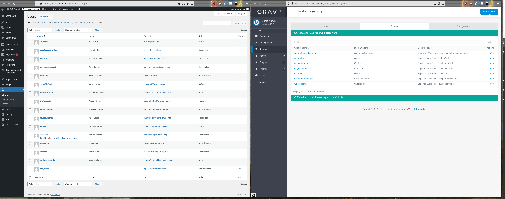

# Export Roles (`wp2grav-roles`)

Exports WordPress user roles as a Grav `groups.yaml` configuration file.



## Usage

**WP-CLI:**
```bash
wp wp2grav-roles
```

**Admin UI:** Click the **Export Roles** button under Tools > WP2Grav Exporter.

## What It Exports

All WordPress roles are converted to Grav groups and written to a single `groups.yaml` file.

## Output Structure

```
<export-dir>/config/
└── groups.yaml
```

## Role Mapping

Each WordPress role becomes a Grav group named `wp_<role>` with spaces replaced by underscores and converted to lowercase.

| WordPress default roles | Grav group         |
| ----------------------- | ------------------ |
| `administrator`         | `wp_administrator` |
| `editor`                | `wp_editor`        |
| `author`                | `wp_author`        |
| `contributor`           | `wp_contributor`   |
| `subscriber`            | `wp_subscriber`    |

A special group, `wp_authenticated_user`, is also created and assigned to all exported users (see [export-users](export-users.md)).

Other custom roles will also export using the format above.

## Permissions

| Group                   | Permissions                                |
| ----------------------- | ------------------------------------------ |
| `wp_administrator`      | `admin.login`, `admin.super`, `site.login` |
| All other `wp_*` groups | `site.login`                               |
| `wp_authenticated_user` | `admin.login`                              |

> [!CAUTION]
>  Accounts in `wp_administrator` receive `admin.super` access, which grants full administrative control of the Grav site.

## Importing to Grav

Copy the `groups.yaml` in `<export-dir>/config/` directory to your Grav's `user/config` directory.  This will override any existing groups.
