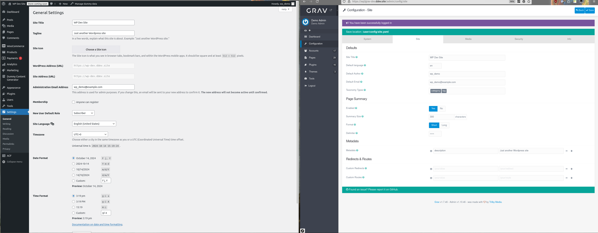

# Export Site Metadata (`wp2grav-site`)

Exports WordPress site settings as a Grav `site.yaml` configuration file.



## Usage

**WP-CLI:**
```bash
wp wp2grav-site
```

**Admin UI:** Click the **Export Site** button under Tools > WP2Grav Exporter.

## What It Exports

- Site title (from WordPress General Settings)
- Site description/ tagline
- Admin user's name and email (from the account associated with the admin email address)
- All public taxonomy names (e.g., `category`, `tag`, plus any custom public taxonomies)

## Output Structure

```
<export-dir>/config/
└── site.yaml
```

## Importing to Grav

Copy the `site.yaml` in `<export-dir>/config/` directory to your Grav's `user/config` directory.  This will override any existing site configuration.
