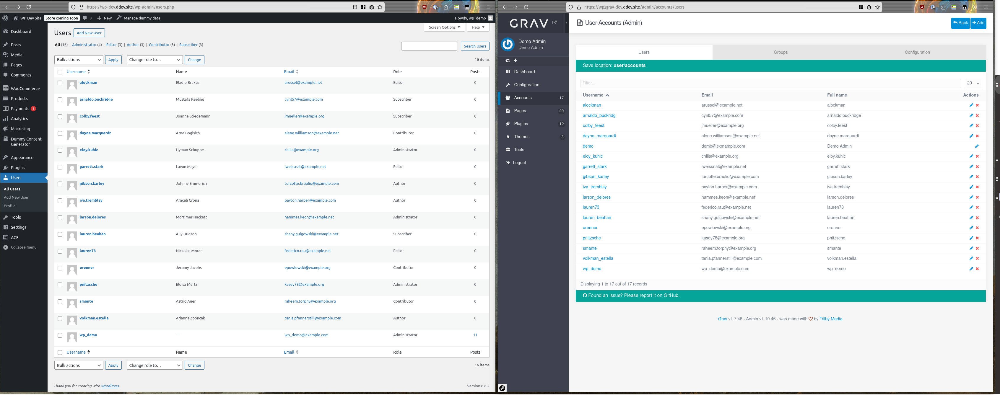

# Export Users (`wp2grav-users`)

Exports WordPress user accounts as Grav-compatible YAML account files.



## Usage

**WP-CLI:**
```bash
wp wp2grav-users
```

**Admin UI:** 

Click the **Export Users** button under Tools > WP2Grav Exporter.

## What It Exports

All WordPress users are exported as individual YAML files.  Each account file includes their:

- Email address
- Full name and nickname
- Language/locale (converted from WordPress locale codes to Grav locale codes)
- WordPress roles, converted to Grav groups memberships
- Additional WordPress metadata

## Output Structure

```
<export-dir>/accounts/
└── <username>.yaml   # One file per user
```

## Username Conversion

WordPress usernames are normalized to meet Grav's requirements:

- Minimum length: 4 characters (padded with the user's WordPress ID if too short)
- Maximum length: 16 characters (truncated if too long)
- If a username is truncated or padded, the WordPress user ID is appended to avoid collisions

Example: A username `jo` (2 chars) with WP ID `5` becomes `jo5_` (padded with underscores `_` to the minimum number of characters, typically 4). A username `averylongusername` and an ID of `12` becomes `averylongusern12` (truncated at the default 16 characters, with ID appended).

## Passwords

Passwords in each exported YAML file are randomly generated and have no connection to the original WordPress account. The plaintext password is automatically converted to a hashed password by Grav the first time the account authenticates on the Grav site.

> [!Note]
> Users will need to be told their new passwords or directed to use Grav's password reset functionality before authenticating.

## Groups

Each user is assigned:

- `wp_<role>` for each of their WordPress roles (e.g., `wp_subscriber`, `wp_editor`)
- `wp_authenticated_user` (added to all exported users)

## Example Account File Format

```yaml
email: user@example.com
wp:
    id: 5
    user_url: 'https://example.com'
    display_name: Jane Doe
    nickname: janedoe
    description: ''
    first_name: Jane
    last_name: Doe
fullname: janedoe
title: null
state: enabled
language: en
groups:
    - wp_subscriber
    - wp_authenticated_user
password: randomGeneratedPassword
login_attempts: {  }
```

## Importing to Grav

Copy the content in `<export-dir>/accounts/` directory to your Grav's `user/accounts` directory.
